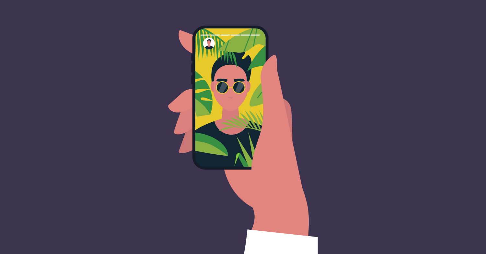
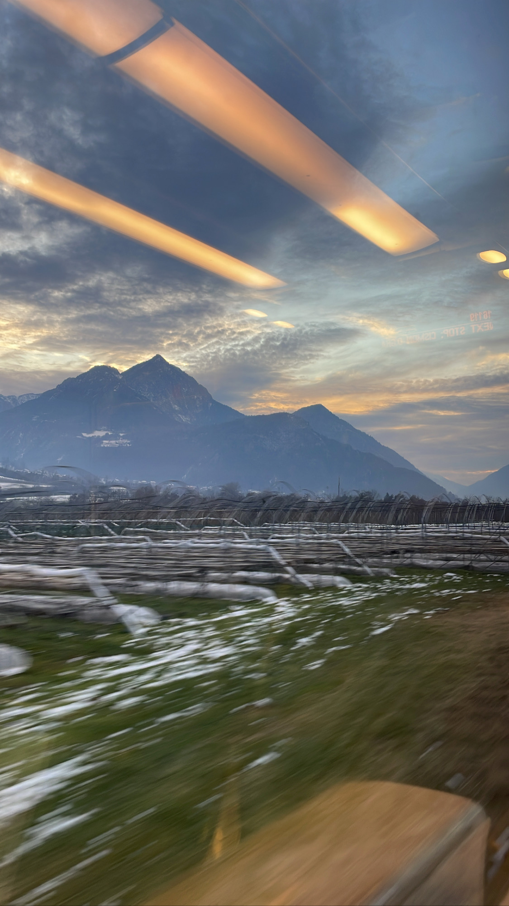
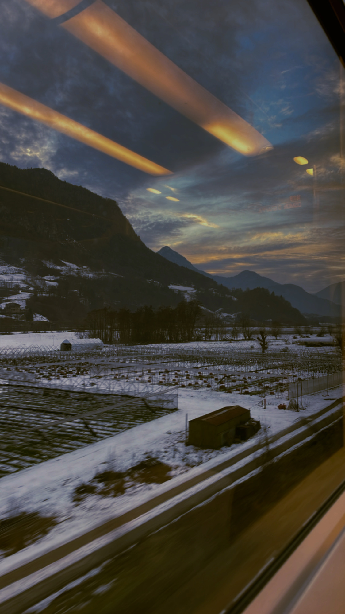
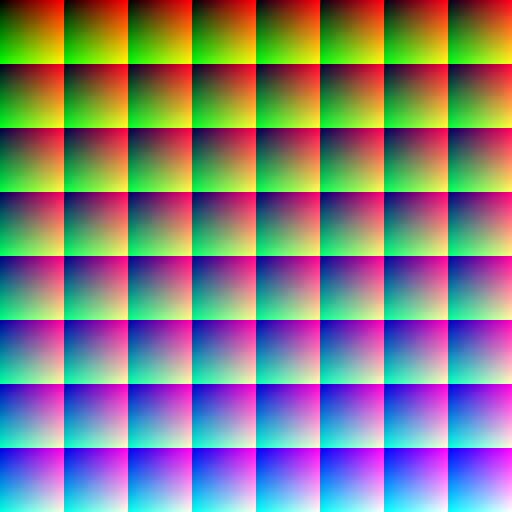
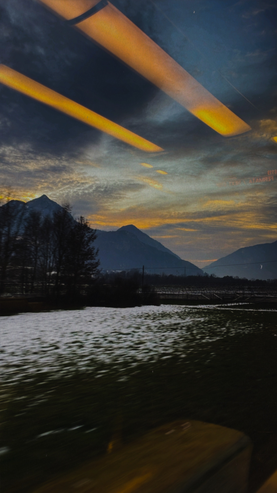
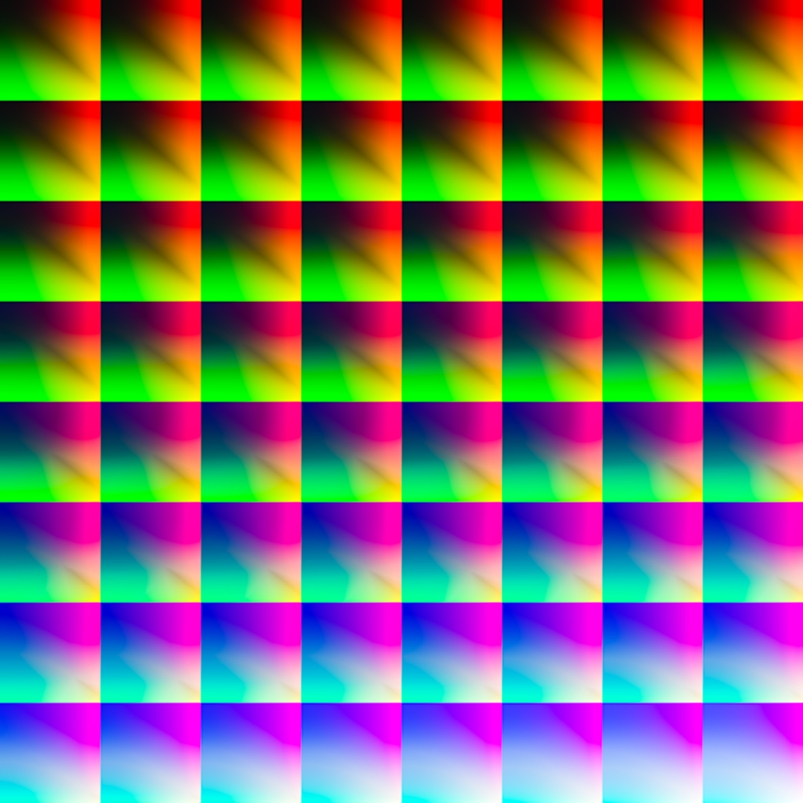

# **AR Projects**
The projects in this repo has been created with [Meta Spark AR](https://sparkar.facebook.com/ar-studio/) . 
I started creating AR filters just for my personal use, some of them are published on my [Instagram](/link)
Ignore strange / cringy names, was just me at 2 am without good names ideas 😅

-----------------------
 ## Table of Contents  
1. [Blue Vibes](#bv)  
2. [Dark Academy](#da)
3. [Indoor 1](#id1) 
4. [Indoor 2](#id2) 
5. [M1]()
6. [P5]()
7. [Vinty]()

-----------------------

<a name="bv"/>

## 1. Blue Vibes
|Original |Filtered |
|--|--|
|  |  |
|  |  |
----------

<a name="bv"/>

## 2. Dark Academy
|Original |Filtered |
|--|--|
|  |  |
|  |  |
----------
