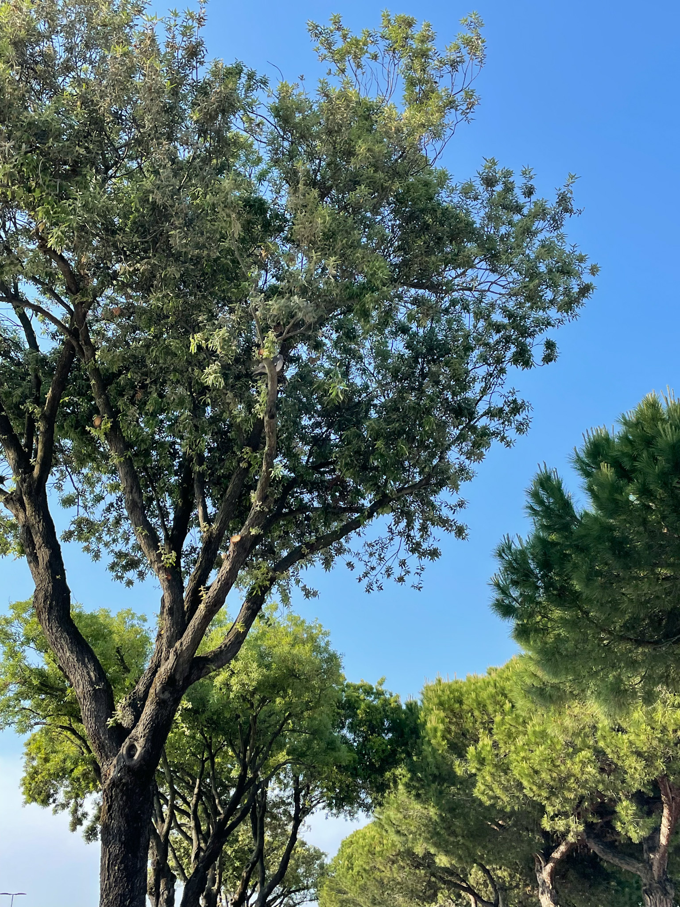
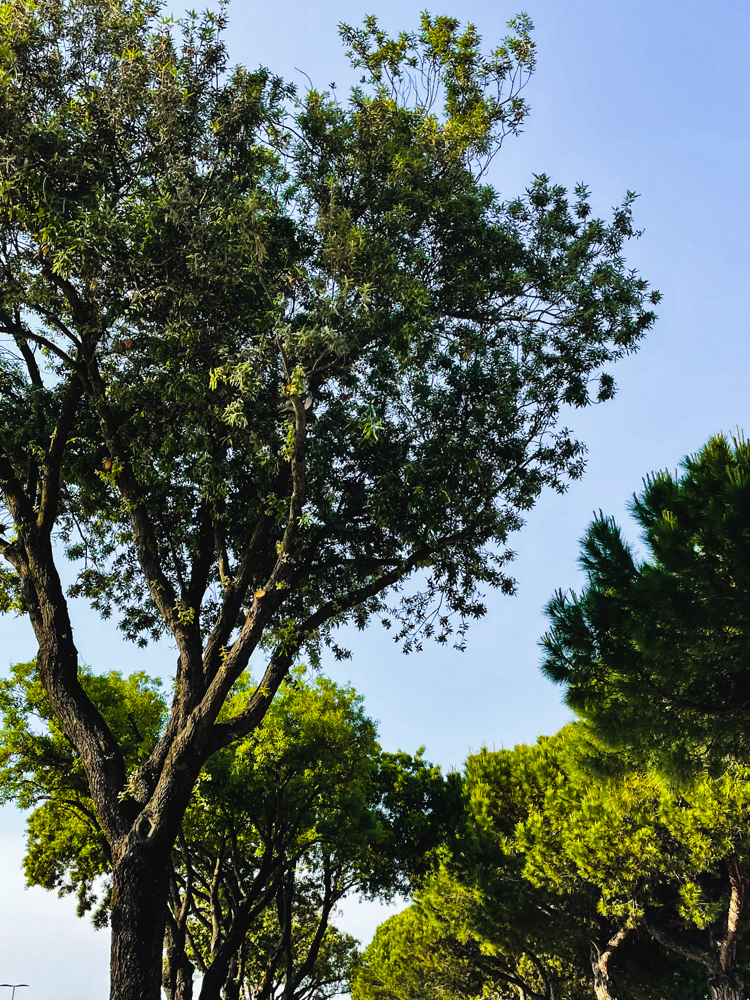
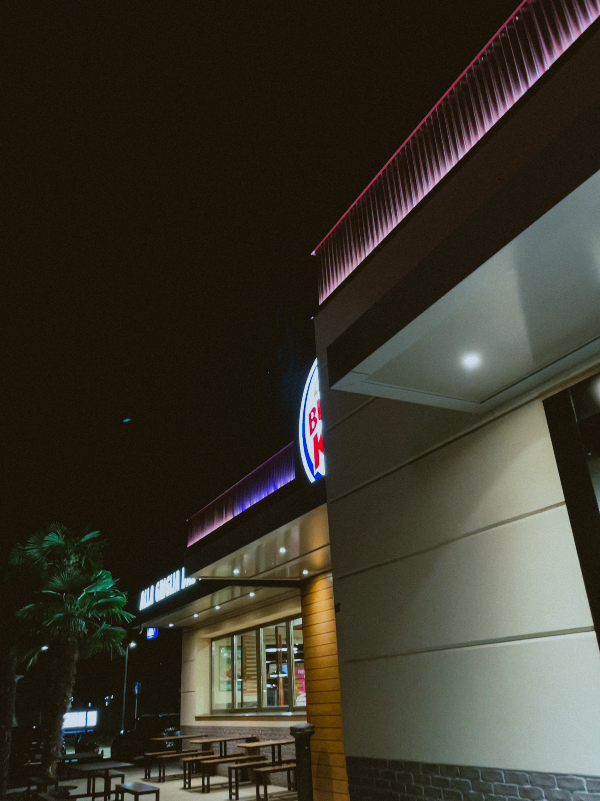
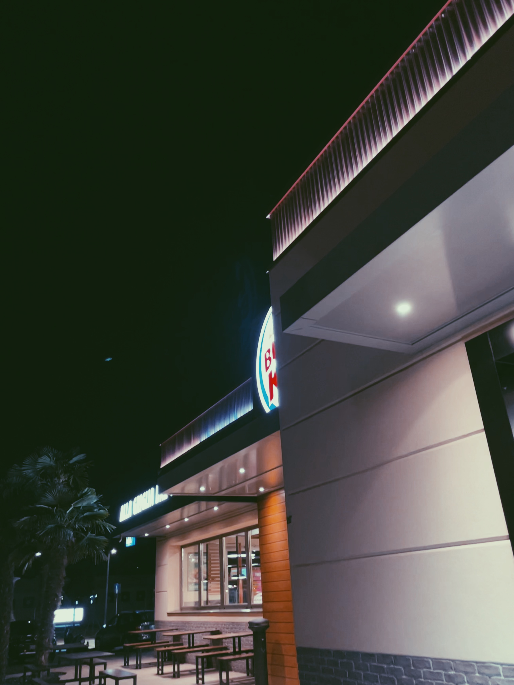
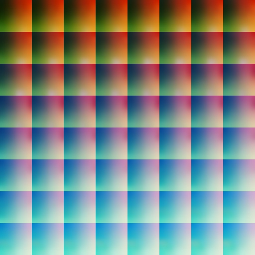

# **AR Projects**
The projects in this repo has been created with [Meta Spark AR](https://sparkar.facebook.com/ar-studio/) . 
I started creating AR filters just for my personal use, some of them are published on my [Instagram](/link).

You won't see any fancy / top scripting filters mainly because I fell in love with minimalism and if these are personal projects I create filters that I would like to use and enjoy. Cheers 💙

> Ignore **strange / cringy** names, was just me at 2 am without good names ideas 😅

-----------------------
 ## Table of Contents  
1. [Blue Vibes](#bv)  
2. [Dark Academy](#da)
3. [Indoor 1](#id1) 
4. [Indoor 2](#id2) 
5. [M1]()
6. [P5](#p5)
7. [Vinty]()

-----------------------

<a name="bv"/>

## 1. Blue Vibes
|Original |Filtered |
|--|--|
|  |  |
|  |  |
----------

<a name="da"/>

## 2. Dark Academy
|Original |Filtered |
|--|--|
|  |  |
|  |  |
----------

<a name="id1"/>

## 2. Indoor 1
|Original |Filtered |
|--|--|
|  |  |
|  |  |
----------

<a name="p5"/>

## 2. P5
|Original |Filtered |
|--|--|
|  |  |
|  |  |
----------
# [ WIP👨🏻‍💻😵‍💫 ]